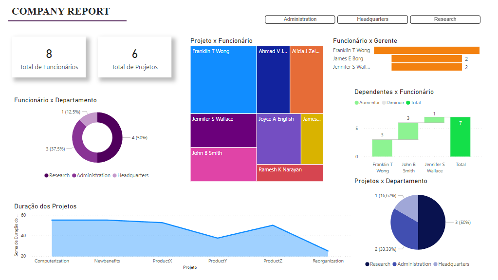

# Processando e Transformando Dados com Power BI

Este repositório possui o Desafio de Projeto proposto pelo [Santander Bootcamp 2023 - Ciência de Dados com Python](https://web.dio.me/track/santander-bootcamp-2023-ciencia-de-dados-com-python), no módulo **Processando e Transformando Dados com Power BI**.

Para a elaboração deste projeto, foi criado um banco de dados em nuvem utilizando a Azure, o qual posteriormente foi integrado ao MySQL e ao Power BI. 

A base de dados foi alimentada utilizando o Workbanch, em sequencia o Power BI foi utilizado para a limpeza, analise dos dados e criação do Company Report.

## 📋 Relatório Descritivo

- Foi realizado a verificação dos tipos de dados das colunas e alteração dos nomes das mesmas para tornar a base de dados mais legível;
- Alterado o tipo da coluna "Salário" para *número decimal fixo*;
- Analisado os valores nulos contidos na base de dados, constatando uma única ocorrência. O campo em questão se referia ao Super_ssn de um funcionário, porém foi identificado que o funcionário é o Gerente do setor em que trabalha e não possui gestão. Sendo assim, o valor nulo é válido. Não foram identificados outros campos nulos;
- Adicionado o número de horas por projeto à planilha ***azure_company project***;
- Na planilha ***azure_company employee*** o campo endereço foi divido em "Rua", "Numero", "Cidade", "Estado'. Além disto, foi adicionado a coluna "País";
- Ainda na planilha ***azure_company employee***, foi realizado o processo de mesclar colunas para tornar os campos Fname, Minit e Lname uma única coluna com o nome completo; 
- Foi criado a tabela ***employee_dept***, após mesclar as tabelas ***azure_company employee*** e ***azure_company departament***. Para a criação da nova tabela, o processo de mescla utilizou a tabela employee como base. Nesta etapa foram excluídas as colunas desnecessárias;
- Foi criado a tabela ***manager***, após mesclar as tabelas ***employee_dept*** e ***azure_company departament***. Para a criação da nova tabela, o processo de mescla utilizou a tabela employee_dept como base. Nesta etapa também foram excluídas as colunas desnecessárias;
- Foi criado a nova tabela ***dept_locations***, onde foi feito a mescla do nome do departamento e localização do mesmo, tornando assim cada combinação departamento-local uma combinação única;
- Foi realizado uma ultima analise das tabelas e colunas, onde foram excluídos as colunas desnecessárias que permaneciam na base de dados;
- Após a tratativa da base de dados, foi gerado o relatório ***COMPANY REPORT***

## ✏️ Observações: 
A utilização da função "Mesclar" possibilida a união de dados com base em colunas-chave compartilhadas, o que possibilita trabalhar com conjuntos distintos e com estruturas diferentes. Enquanto isso, a função "Atribuir" adiciona linhas de um conjunto ao final de outro, o que é útil quando os conjuntos têm a mesma estrutura. 
